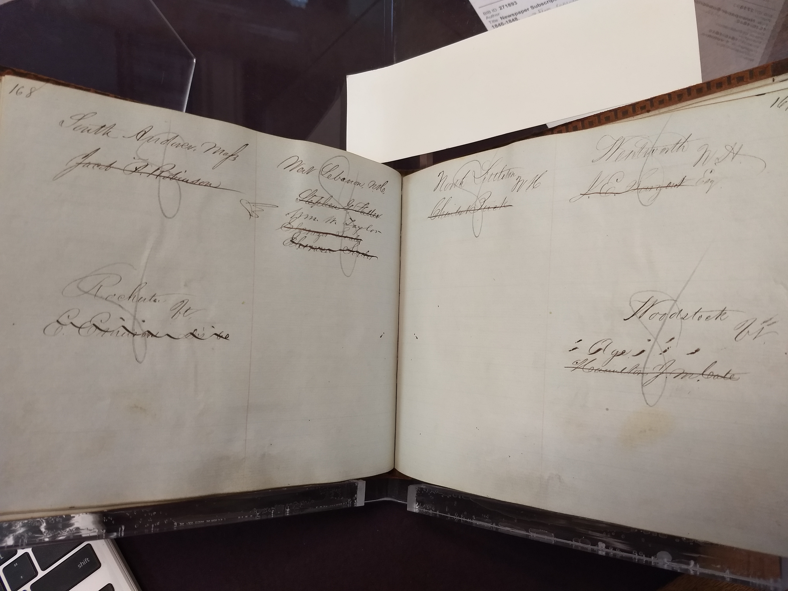
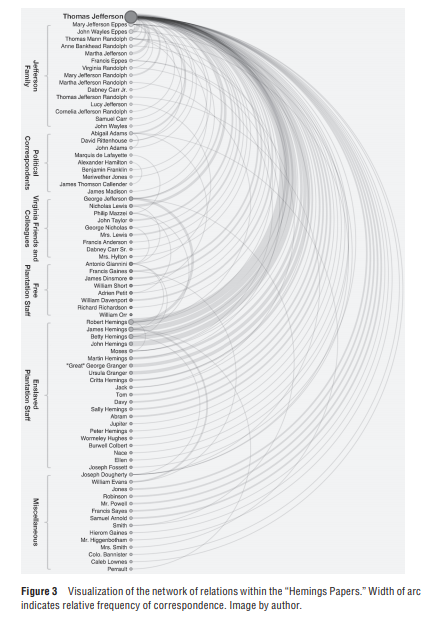
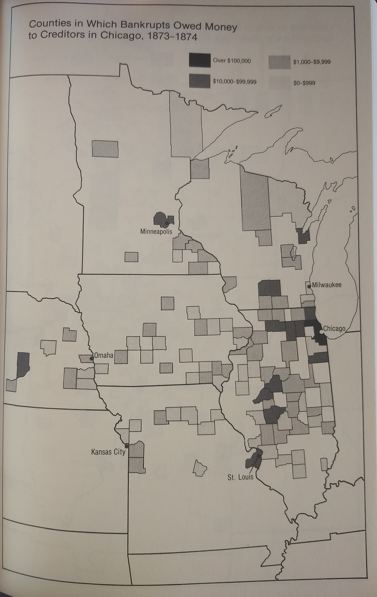
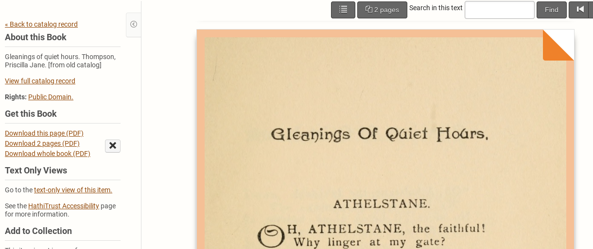
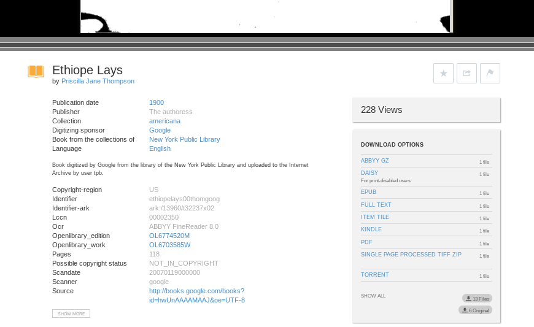
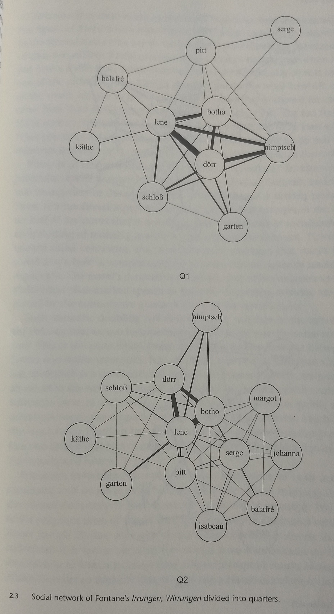
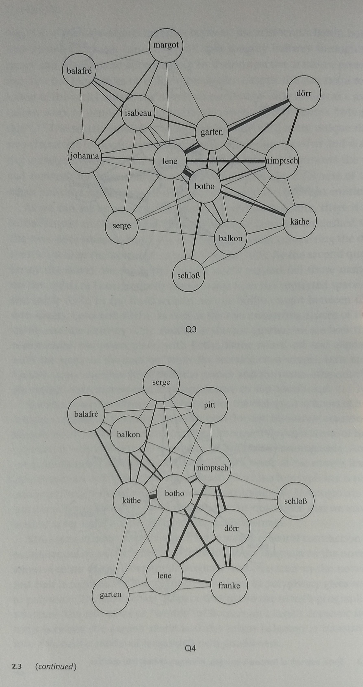
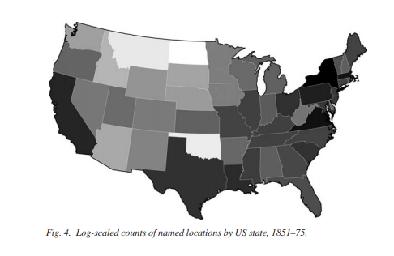

```{r setup, include=FALSE}
knitr::opts_chunk$set(echo = TRUE)
if (!(require(dplyr))) {
  install.packages("dplyr", repos = "http://cran.us.r-project.org")
}

library("dplyr")
library("knitr")
```

Welcome to this introductory workshop on data in the humanities! This workshop is designed as an introduction to the first and often highest hurdle in the whole process: translating materials into usable data formats. It will also provide a soft introduction to programming, survey some examples of effective data-driven scholarship, and discuss some of the opportunities and costs of translating into data. One of the goals is a reminder that humanists have always used data in scholarship, even before the advent of the database search made digital humanists of us all. 

Take a look around: you're in RStudio, an environment that makes coding in R more transparent. Your window is divided into four segments. In the upper right, you'll see the environment: this displays all the objects you have loaded into memory (currently none). In the upper left, you'll see the script editor: this is the place to work on code that you're currently writing (or borrowing from elsewhere!). To run code in code chunks (the grey chunks), you can either press Ctrl+Enter to run single lines or click the green arrow to run the entire chunk. In the lower left, you'll see the console: this is where code actually executes and where the output prints. In the lower right, you'll see a few different things. The "Files" tab shows whatever files live in the directory (or folder) that R is currently working in; if you run any plots, they'll show up in the "Plots" tab; you can also get help in the "Help" tab.

To start, if you're using your own computer, run the section of setup code above by clicking the green arrow in the upper right of the grey box.

# What is Data?

For our purposes, we can think of data as a set of atomic, regularized observations that can be organized into categories for the sake of foregrounding broader patterns of relation. Data, then, is something we do: it is the product of one kind of analysis undertaken in order to conduct another kind of analysis. It's easy to overlook the choices entailed here when it comes to things we've come to readily accept as data, like a timestamp. But awareness of this fact helps us better understand both the limits of the data we encounter and the uses of transforming sources into data.

There are several different types of data:

* Numerical
    + Discrete (1, 5, 180; the number of books, people)
    + Continuous (4.66, 30.2%, .76; distances, percentages, prices)
* Categorical
    + Boolean (true/false)
    + Contained (letters, congressional party membership)
    + Proliferating (shades of color, subgenres)

Often our data is compound. Technically, the only simple categorical types are boolean and individual characters. Any combination of characters - words, sentences, books - is already multiple bits of data strung together. We call this a *character string*. 

Of course, we don't really work with just one datum. Computers, like human readers, need to break large undiscriminated data into atomic, regular parts. In one sense a book is just one long character string, but we wouldn't be able to make sense of this: we make sense of words in sequence. We, like our computers, work with series of data points. In programming, we call this a *vector* of *elements*. For example:
```{r}
c("MA", "NH", "NH", "NH", "NH", "VT", "NH", "NH", "VT", "VT")
```

Here several categorical elements (state postal abbreviations) are combined into a vector with the basic function `c`. A function is anything that operates on data, and in R the data on which we want a function to operate is placed within parentheses and separated by commas. If you run the line of code above, it'll simply print in the console. Note that each element remains separate in a vector: we haven't merged them. If we want to save it as an object in memory for later use, we simply add an arrow, `<-`, pointing to whatever you want to name that object. This is the basic syntax of R.
```{r}
states <- c("MA", "NH", "NH", "NH", "NH", "VT", "NH", "NH", "VT", "VT")
```

Now if you type "states" into the console and click enter, you'll see its content printed. But we don't need to have all of our data at once. We can *index* just a subset of it by using brackets `[]`. We might just want the first element; this is indexed as so:
```{r}
states[1]
```

We might instead want a range of elements. To designate this, we place a colon, `:`, between the desired start position and end position.
```{r}
states[3:5]
```

More on this shortly. First, let's get more data.

# Data in the Archive

Sometimes our objects of study are already data themselves. Take, for example, this antebellum American newspaper's subscription book. This is already a technology for organizing and storing data; we simply want to transcribe it so that we can represent and analyze it more effectively. Depending my research, I might want to quantify subscribers by gender, map their locations, or calculate turnover.

{ width=70% }

The best format for representing multidimensional data is a spreadsheet, whether in Microsoft Excel, Google Sheets, or whichever other program you prefer. The most efficient transcription practice is to use one of these software tools to record information from the very start, whether you're looking at an object in an archive or online, even if you're not yet sure what you're going to do with it. In R, data in this format is called a *data frame*.
```{r}
names <- c("Jacob Robinson", "Stephen Fuller", "William Taylor", "Ebenezer Seales", "Ebenezer Seales", "E Emerson", "Charles Buck", "J Sargent", "Age", "Hamilton Cate")
genders <- c("M", "M", "M", "M", "M", "M", "M", "M", "NA", "M")
towns <- c("South Andover", "West Lebanon", "West Lebanon", "West Lebanon", "West Lebanon", "Rochute", "North Littleton", "Wentworth", "Woodstock", "Woodstock")
data.frame(Name=names, Gender=genders, Town=towns, State=states)
```

The basic principle of organizing data into this format is that it is highly structured. In order to take full advantage of this capacity, three conditions should be met:

- Each variable must have its own column
- Each observation must have its own row
- Each value must have its own cell

Getting data into this format will ensure that any future quantitative analysis moves smoothly. It's most efficient to do so from the very start.

It's possible that you may need to combine variables, or columns, later, but with computation it's very easy to combine variables, as with the `paste`. `paste` wants three inputs: the two objects being pasted together and the method (in this case, separating with a comma and a space).
```{r}
paste(towns, states, sep=", ")
```

Spreadsheet editors tend to have easy merging commands as well. In Google Sheets, for example, it's `=textjoin(", ", 1, K1, J1)` (replacing "K1" and "J1" with whichever cells are to be merged).

It's still possible to separate out one variable into two, but irregularities in your data can cause errors more readily. Here is a line of code that separates out first names, but if I had included periods after first initials ("J." instead of "J") it would require a bit more tweaking.
```{r}
gsub("(^\\w+) \\w+$", "\\1", names)
```

When inheriting spreadsheets from someone or somewhere else, these are two of the most common operations necessary for cleaning before analysis can begin. But there are more powerful functions that can be carried out in an instant in a programming language like R that are much trickier otherwise. Transposing a spreadsheet, flipping the rows and columns, just requires one `t` function; separating out alternating values in one column and spread across two columns can be done with `spread`.

But there's other data in our archival document too. For example, some entries aren't individual subscribers: they're other newspapers. When transcribing, we want to be information-inclusive in order to capture as much of the richness of the data as possible. In this case, we can easily render qualitative information as a categorical variable.
```{r}
paper <- c(0, 0, 0, 0, 0, 0, 0, 0, 1, 0)
data.frame(Name=names, Gender=genders, Town=towns, State=states, Paper=paper)
```

There might be further implicit or noncharacter information contained in archival materials. This might include marginalia in printed documents or physical characteristics of materials. Some names are crossed out here; while it's impossible to know when they were crossed out, we know that their subscriptions ended before the life of this ledger did. This gives us a snapshot of a single moment of the data, which otherwise spans a couple years, and could help us better understand the whole.
```{r}
cancel <- c(1, 1, 0, 1, 1, 1, 1, 1, 0, 1)
ledger <- data.frame(Name=names, Gender=genders, Town=towns, State=states,
                     Paper=paper, Cancel=cancel)
ledger
```

Data frames can be indexed by individual cell, with a comma (`,`):
```{r}
ledger[1,1]
```

By row:
```{r}
ledger[1,]
```

Or by column, with a dollar sign (`$`):
```{r}
ledger$Name
```

But the real beauty of indexing is that we don't need to know the positions already. We can index the result of another function. The `which` function tells us which elements of a vector meet a particular condition.
```{r}
which(ledger$Cancel < 1)
```

Indexing these positions back into the ledger data frame as rows will give us the corresponding values.
```{r}
ledger[which(ledger$Cancel < 1),]
```

By calculating the `length` of our results - the number of elements in the vector produced by a function like `which` - we can do some basic arithmetic. What proportion of entries in the ledger were active subscribers upon its retirement?
```{r}
length(which(ledger$Cancel < 1)) / length(which(ledger$Cancel==1))
```

This is just the beginning, but it's enough to understand the basic principles at play here and, hopefully, their utility.

A note about file formats: the most unversal format for spreadsheet data (and the most size-efficient) is a .csv file. This isn't the default for programs like Excel, but you can still open, edit, and save .csv files in Excel or Sheets, and if you start in one of those programs before shifting over to a programming language like R you'll need to save your spreadsheet as a .csv first (an option in the "Save as" menu). Writing to drive and reading from drive are each a simple function.
```{r, eval=FALSE}
write.csv(ledger, "ledger.csv")

ledger <- read.csv("ledger.csv")
```

# What Are You Going to Do with That?

Is transcription worth it? That depends. If you merely wanted to know a single fact about your data - ex., what percent of subscribers are in New Hampshire? - it would be easier to just run up a quick tally by hand. If you wanted to know several facts about your data or to try to represent the shape of your data overall, however, you're going to want to digitize. Note that in both cases you'd be working with data: the difference is merely one of degree.

We can apply these same principles to assembling data about multuple archival materials of the same type. That is, in addition to transcribing individual subscription books, account ledgers, etc., we can record metadata about collections of correspondence, texts, or objects.

With this kind of tabular data, there are all kinds of quantitative questions we can easily answer. If you come to one of the [Data 101 workshops offered this semester](https://dh.rutgers.edu/fall-2019-events/) (materials available [on github](https://github.com/azleslie/Data101)) you'll learn the basics of analyzing complex structured data, such as how to query or subset data and how to represent categorically or temporally.

What kind of work could be produced by building data from these documents?

Lauren F. Klein's "The Image of Absence: Archival Silence, Data Visualization, and James Hemings" reorganizes the Thomas Jefferson correspondence into an alternative "Hemings Archive" - even though the enslaved Hemings could not write - by visualizing epistolary exchanges that mentioned him.^[Klein, Lauren F. "The Image of Absence: Archival Silence, Data Visualization, and James Hemings" in *American Literature* 85.4 (December 2013): 661-688.] (Left, below.)

The greatest influence on my own interest in DH was William Cronon's *Nature's Metropolis*, which well predates the naming or debating of a "digital humanities" but nonetheless does superb work on the geography of capital with data drawn from bankrupcy courts in order to illustrate the scope of Chicago's financial influence on the postbellum Midwest.^[Cronon, William. *Nature's Metropolis*. New York: W. W. Norton & Co., 1991.] (Right, below.)

{ width=50% } { width=50% } 

# Utilizing Digitized Texts

There are a number sources of digitized texts online. The most reliable of these is [Project Gutenberg](gutenberg.com), which contains transcriptions of some 60,000 books, fictional and nonfictional.

The Gutenberg page for any given book, will list several format options: the most amiable is the "Plain Text UTF-8" format. Copying and pasting this into a plain notepad .txt document (not a Word .docx document) is all that's necessary to begin working with this text as data. Like a .csv file, this is the simplest and smallest format for text data, which makes it the most reliable to work with. And again, any text file in, say, Microsoft Word can be turned into a .txt format in the "Save as" menu.

Even more easily, you might scrape this text directly off the web and into an object in your computer's memory with `readLines`. Here is *The Theory of the Leisure Class* (1899) by economist and sociologist Thorstein Veblen.
```{r}
book <- readLines("http://www.gutenberg.org/cache/epub/833/pg833.txt")
```

Type "book" into your console and click enter. If you scroll up to the top, you'll see a bunch of stuff that isn't part of the book proper: website metadata, text metadata, an introduction. We'll want to trim that off.

If you went to the webpage we got it from, you could see that the book begins with the line "THE THEORY OF THE LEISURE CLASS" and ends with the line "use and the need of direct and forcible speech." If we search the book object for elements containing those exact character strings, we'll find the exact position for the start and the end of our desired text. The `grep` function does this. I've included a `^` and a `$` because `grep` is otherwise inclusive and will return any longer character strings that happen to include our desired string as well: these serve as metacharacters specifying a hard start and a hard end.
```{r}
start_line <- grep("^THE THEORY OF THE LEISURE CLASS$", book)
end_line <- grep("^use and the need of direct and forcible speech.$", book)

book <- book[start_line:end_line]
```

What exactly is the proper unit of data here? That depends on the question at hand. We could leave it in lines, as it currently stands, which would tell us about the format (in this case the Gutenberg format, but in the next example it would tell us about the print format). So let's remove the line breaks by collapsing all the elements of our book vector together into one big character string with `paste`.
```{r}
book <- paste(book, collapse=" ")
```

We could break this book down to individual characters. There probably isn't much we can say about characters like "e" or "f", but we might learn something from the distribution of "?" or "!" characters. Most likely, though, the most useful unit of data is the word. So we'll split up the book string with `strsplit`, with a break every time there's a non-letter character. Of course, there isn't a character on the keyboard for "non-letter character." To express this regular yet inexact pattern, we'll need what's called a *regular expression*. `\\w` denotes any single letter; `\\W` denotes any single non-letter; `+` denotes one or more of whatever precedes it. Thus we get:
```{r}
book_words <- unlist(strsplit(book, "\\W+"))
```

We could just as easily split our text up into sentences. The only thing to change would be the regular expression, which now includes all the characters that signal the end of a sentence as triggers for splitting the character string. A period needs to be designated as `\\.` because it is a regular expression metacharacter (namely, any character whatsoever). Before doing so, it would be necessary to substitute out periods that don't end sentences. The `gsub` function makes substitutions: the first input is the searched text, the second input is the desired replacement, and the third input is the object.
```{r}
book <- gsub("Mrs.", "Mrs", book)
book <- gsub("Mr.", "Mr", book)

book_sentences <- unlist(strsplit(book, "!?\\."))
```

In either case, we now have an object broken down into regularized atomic units that we can begin to analyze as data.

Project Gutenberg is unfortunately a relatively small collection of texts. It's a great place to look first, since it has the cleanest text anywhere, but it may well not include what you're looking for. Where else can you get texts from? There are several options. The best organized of these is Hathitrust at [hathitrust.org](https://www.hathitrust.org/).

{ width=70% }

Hathitrust offers several access options. It has a .pdf download option on every item page that allows you to either "Download whole book (PDF)" or "Download pages (PDF)" by selecting the upper-right corner of each page that you want to select. The quickest way to get the plain text of a Hathitrust item is by clicking "text-only view of this item." There isn't a direct way to download this as just one .txt file, but you could just copy and paste it. The trouble with this rendering is that it turns each page into a single line of text. This would be a problem if you were working with something where line breaks matter, like poetry. Blank space is data too. But this rendering presents other issues as well, such as the way the running title gets lumped in with the body text.^[Hathitrust does have a [browser API](https://babel.hathitrust.org/cgi/htdc) that allows downloads of the full text, but each page will be a separate .txt file in a folder that also contains an image file for each page - which ends up making it pretty large. If you have plenty of hard drive space, this can be a useful format, but probably only if you have a lot of space and are working with quite a few texts. Hathitrust does offer several other options to experienced computational researchers for obtaining large numbers of texts, but they're much more advanced.]

It is also possible to turn a downloaded .pdf file - from Hathitrust or elsewhere - into a .txt file with Optical Character Recognition (OCR) software. Adobe Acrobat software available on campus computers can carry this out, as can some other free programs, such as [PDF-XChange Editor](https://www.tracker-software.com/product/pdf-xchange-editor) for Windows, which I've found useful, or [pdftotext](https://pypi.org/project/pdftotext/) for Mac. Once a .pdf has a OCR layer, it can be exported as a friendly .txt file.

If you're working with a non-massive number of texts not available on Gutenberg, I recommend the Internet Archive at [archive.org](https://archive.org/), which has 20 million mostly-free texts (and many the same files available on Hathitrust).

Conveniently, Internet Archive has pre-generated .txt pages for each document. To access this, click the "show all" button in the "Download Options" box on the page for any item. On the subsequent page select the option that ends with .txt.

{ width=60% }

Here is *Ethiope Lays* (1900) by the African American poet Priscilla Jane Thompson.
```{r}
volume <- readLines("https://ia800909.us.archive.org/24/items/ethiopelays00thom/ethiopelays00thom_djvu.txt")
```

This text, like Hathitrust's, is still much messier than Gutenbergs. For one, we want to get rid of page numbers. Their squat position on the page of this text presents a problem: though searching for lines that contained only digits (`"\\d"`) would do us some good, it wouldn't go far enough. Index just the elements in volume that have a number of characters (`nchar`) greater than 4 to keep. Sticking with that would normally be good, but if you wanted to retain line breaks (this is poetry after all) you would also need to keep (with `|`, the "or" operator) any line with nothing on it.
```{r}
volume <- volume[nchar(volume) > 4 | nchar(volume) < 1]
```

The running titles will also need to go. Since they're written in a special typeface, however, a plain search won't catch them all either. This is where fuzzy or approximate matching comes in, with the function `agrep`. `agrep` works much like `grep`, except that it also needs a value for the `max.distance` between the searched-for character string in Levenshtein Distances:

Edit | String | Difference | Distance
-------|-----|----|----
Insertion | pluppy | +l | 1
Deletion | pupy | -p | 1
Substitution | poppy | u->o | 1

Since `agrep` is inclusive, it'll also grab longer lines that include the desired (or approximate) character string. To filter this out just requires a couple `nchar` functions.
```{r}
running_titles <- agrep("Ethiope Lays. ", volume, max.distance=6, ignore.case=TRUE)

running_titles <- which(nchar(volume[running_titles]) < nchar("Ethiope Lays. ") + 8)

volume <- volume[-running_titles]
```

In much the same fashion that we've been cleaning these texts, any textual feature - vocabulary, sentence or line length, rhyme, meter, character development, themes, plot arcs - can be described and represented as data, though some of these are trickier than others. Some can be measured with just the text itself (vocabulary, length). Some will require a bit of prior non-computational analysis to identify (character, theme). Others will require reference files that supply additional information, such as a dictionary (part of speech, syllables, stress) or a sentiment dataset.^[We can get these easily online too. The `tidyword` package for R contains sentiment datasets, and dictionaries abound: `dictionary <- readLines("http://www.gutenberg.org/cache/epub/29765/pg29765.txt")`]

To save your work to disk, just use `writeLines` and give it a file name.
```{r, eval=FALSE}
writeLines(volume, "thompson_ethiope_lays.txt")
```

# What Are You Going to Do with That, Again

What can you do with this kind of data? My [Intro to Quantitative Textual Analysis](https://github.com/azleslie/TextAnalysisIntro) workshop can teach you how to carry out several operations, such as determining which words in a text most often follow feminine vs. masculine possessive pronouns or representing the affective arc of a text by shifts in sentiment.

Some scholars have generated character networks in novels based on name co-occurence (there are many different ways to measure this). In *Enumerations: Data and Literary Study*, Andrew Piper does this for Theodor Fontane's *Irrungen, Wirrungen* by quarters in order to show the shifting (and gendered) unfolding of relations over the course of the plot.^[Piper, Andrew. *Enumerations*. Chicago: University of Chicago Press, 2018.]

{ width=40% } { width=40% }

Others have extracted location names (there are a number of tools for doing so, including the [Stanford Named Entity Recognizer](https://nlp.stanford.edu/software/CRF-NER.shtml)).^[I recommend [this introduction](http://www.themacroscope.org/2.0/using-the-stanford-named-entity-recognizer-to-extract-data-from-texts/) if NER is something you're interested in pursuing.] Francesca Giannetti, our Digital Humanities librarian at Rutgers, has previously run a [tutorial mapping Henry James' *A Portrait of a Lady*](https://francescagiannetti.com/lab-2-making-digital-maps/).

Most quantitative textual analysis projects, however, deploy datasets of many texts. The flashiest of these projects use entire digitized libraries, but this is not the only possibility. Datasets of texts can be assembled according to many different principles depending on the inquiry. Focused inquiries - ones that ask questions particular to a particular "complete" group of texts - can reveal a lot with considerable confidence even with a relatively small number of texts. Key here is to clearly define the terms of inclusion in a manner consistent with the mode of inquiry. For example, you might assemble a dataset based on:

- The texts of a scholarly bibliography, e.g., the Andrews List of Slave Narratives.
- The texts on a historical list, e.g., novels recommended by the staff literary critic at the *Ladies Home Journal* in the late 19th century or *Publisher's Weekly* bestsellers from 1900-1910.
- The texts that met a particular historical condition, e.g., volumes of poetry published in 1840 or textbooks published by Houghton Mifflin in the 1890s.
- The texts that cataloguers classify in the same category, e.g., detective fiction.

Some pre-assembled datasets can be found online. How would you go about organizing one of your own? Like everything else, this too can vary depending on the project. Nonetheless, a safe starting point - and in most cases a good ending point - would be a simple folder, or directory, containing each text as an individual, cleaned but pre-tokenized .txt file.

Once we begin to ask questions of many texts, the floodgates really open. Instead of mapping a single text, Matthew Wilkens maps the "The Geographic Imagination of Civil War-Era American Fiction" by tracking named locations and their geographic distribution.^[Wilkens, Matthew. "The Geographic Imagination of Civil War-Era American Fiction." *American Literary History* 25.4 (2013): 803-840.] Any feature tracked in a single text can be tracked across many texts to observe broader patterns in a particular group or over time.

{ width=60% }

To download the materials from this workshop to work through them on your own, visit [https://github.com/azleslie/DatainHumanities](https://github.com/azleslie/DatainHumanities). If you're new to R, I recommend starting out with the [RStudio Cloud](https://rstudio.cloud); all that's needed is a Google account and you can have an RStudio environment up in seconds.

Finally, we would really appreciate it if you took a minute to [fill out our brief feedback survey](https://rutgers.ca1.qualtrics.com/jfe/form/SV_a3itiZN18dY3fc9).

Thanks for coming!


